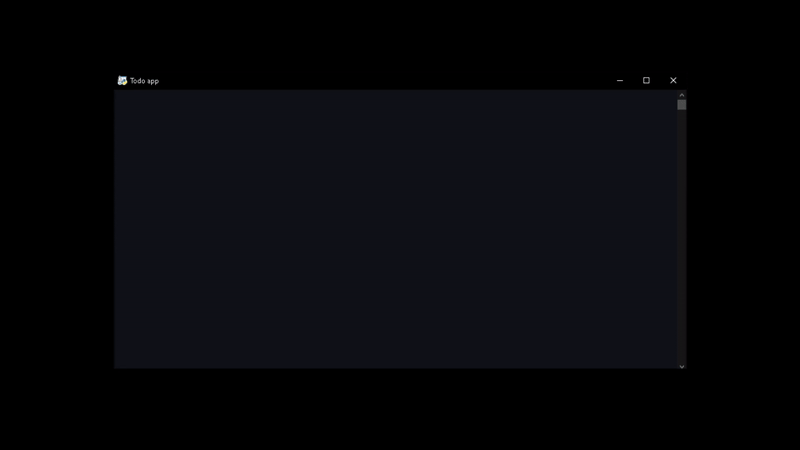
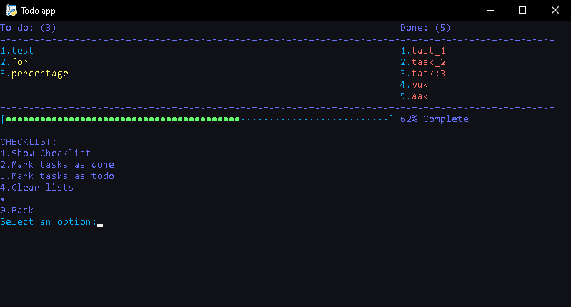
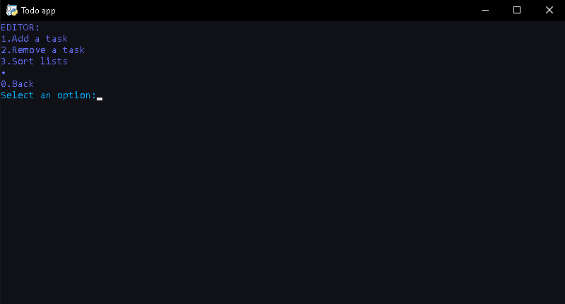
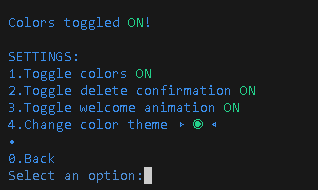
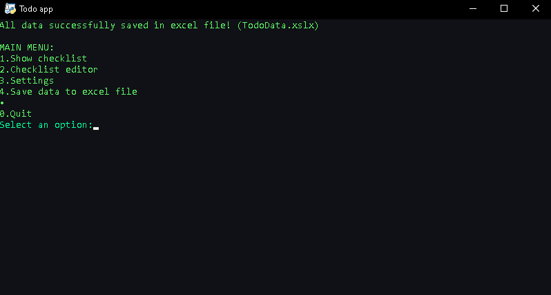

# CMD Todo App

CMD Todo App is a Python-based todo application developed over the course of a weekend as a fun project. While the code might be a bit messy due to the lack of a clear plan during development, the code works as intended in all tested case scenarios.
I included alot of preview images in the "Images" folder, feel free to check them out.

## Features and Settings

### Todo Checklist Tab
- Divided into two sections: "Done" and "Todo".
- Includes a progress bar at the bottom indicating the number of tasks completed.


### Task Management
- **Add**: Ability to add tasks to the todo list.
- **Remove**: Option to remove individual tasks.
- **Clear**: Clear the entire todo list.
- **Sort**: Automatically sorts tasks alphabetically or by character length in ascending or descending order.


### Settings
- **Text Color**: Toggle the colors of the CMD text.
- **Delete Confirmation**: Toggle confirmation prompt for task deletion.
- **Welcome Animation**: Toggle the welcome animation displayed on app startup.
- **Color Theme**: Choose from 8 different color styles that change the app's colorway.


### Data Management
- **Auto-save**: All data is automatically saved.
- **Export to Excel**: Option to save data to an Excel file with just one button.


## Installation

1. Clone the repository:

    ```bash
    git clone https://github.com/Sampise/CMD-Todo-App.git
    ```

2. Navigate to the project directory:

    ```bash
    cd cmd-todo-app
    ```

3. Run the script:

    ```bash
    python Main.py
    ```

## Dependencies

- [colorama](https://pypi.org/project/colorama/): 0.4.4
- [pandas](https://pypi.org/project/pandas/): 1.3.3
- [pyperclip](https://pypi.org/project/pyperclip/): 1.8.2

## Contribution

While the project is considered finished, contributions are welcome! Feel free to open issues or submit pull requests.
